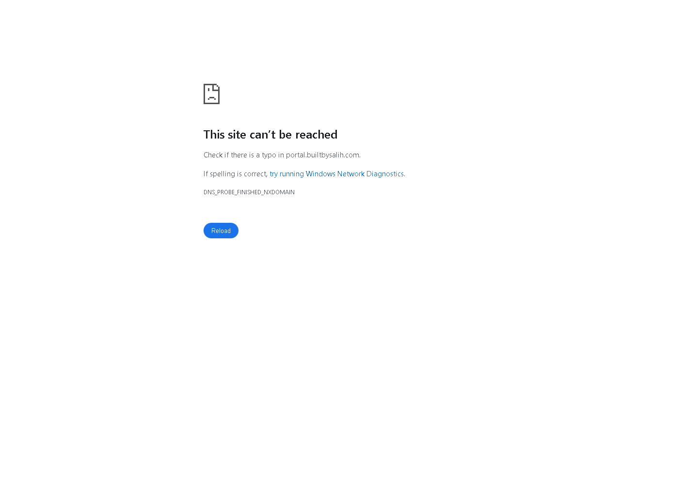
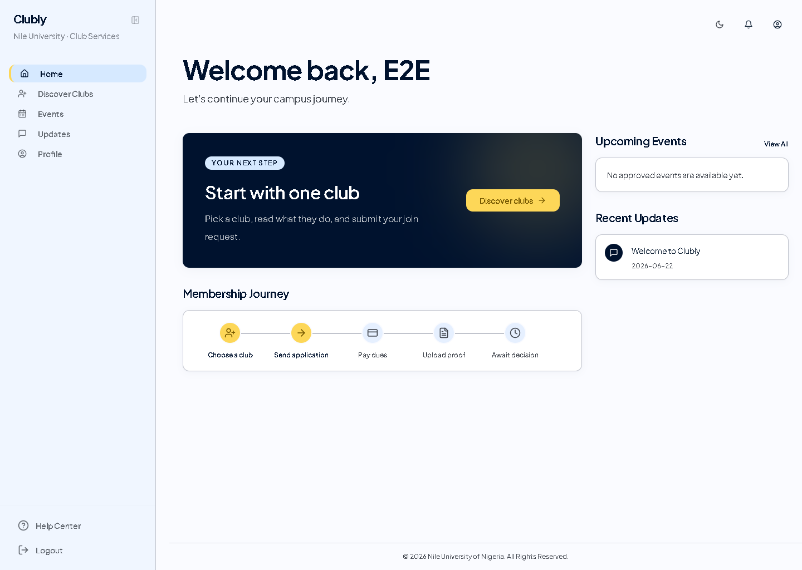
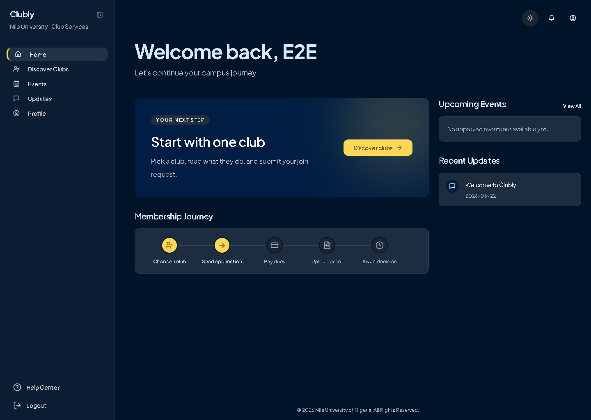
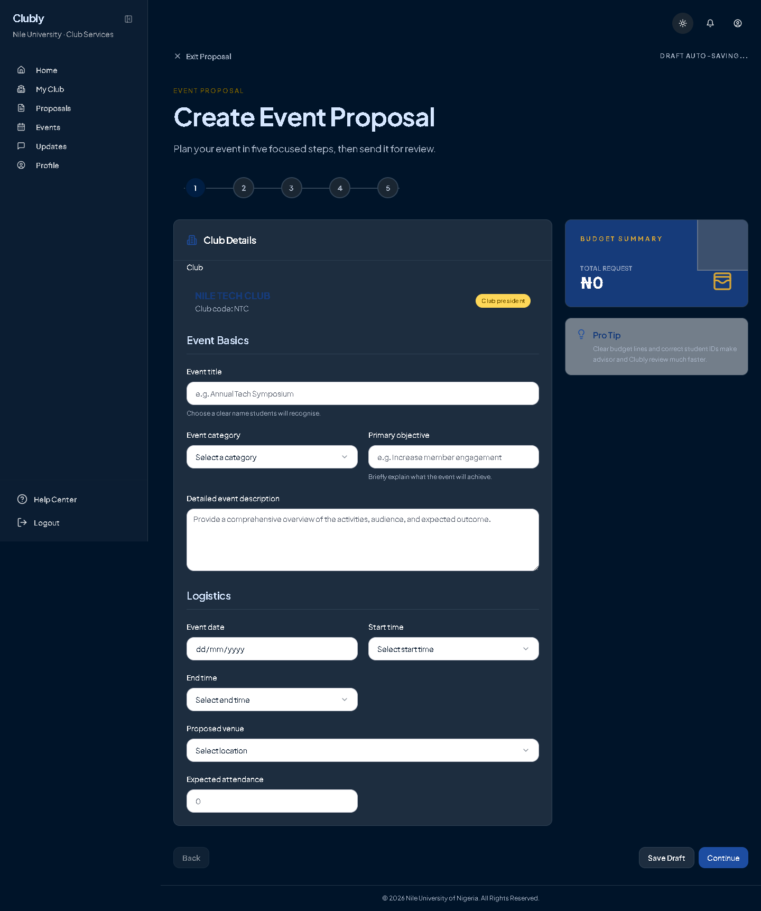
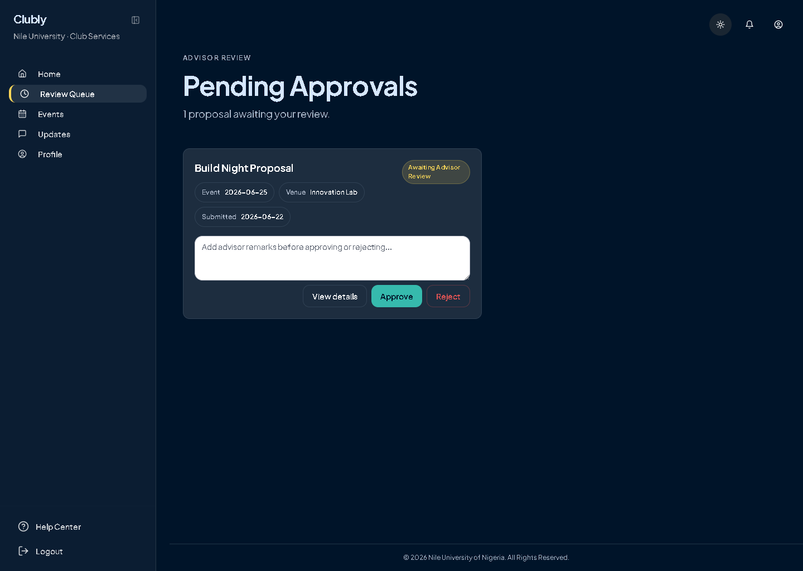
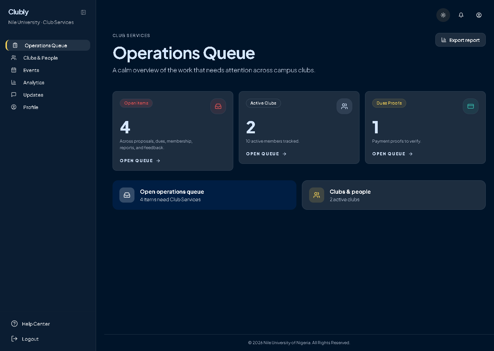
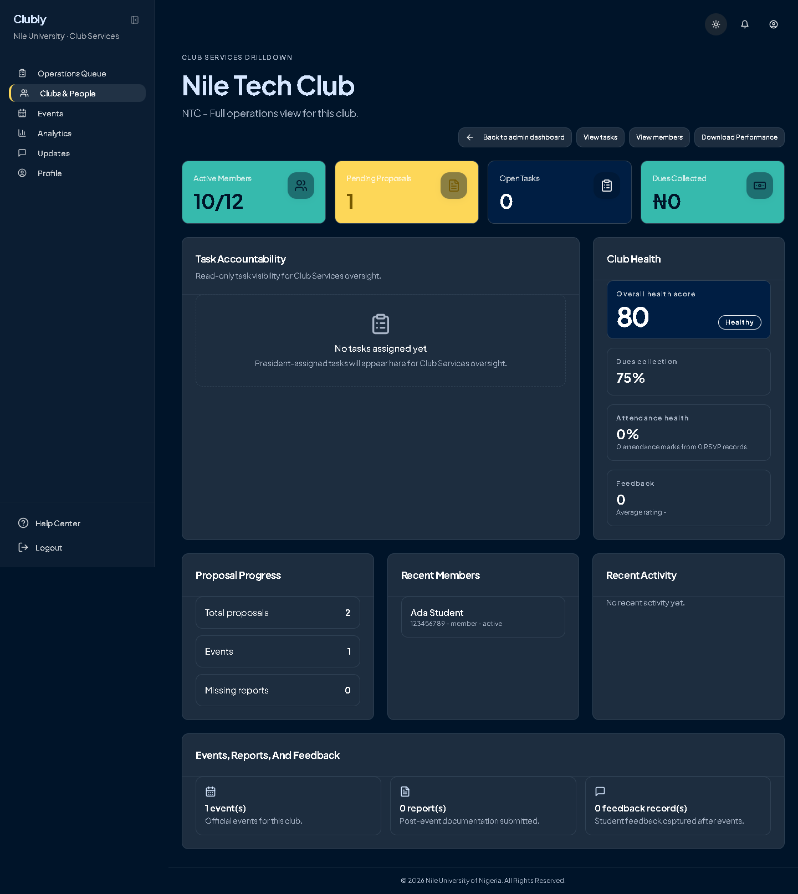
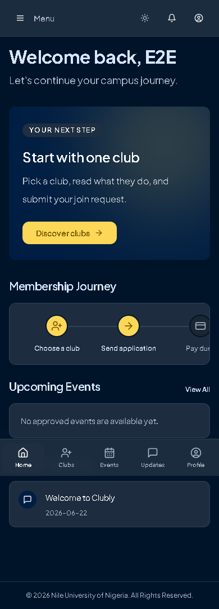

# Clubly / Campus One Developer Guide

**20 July 2026**  
Club management, events, proposals, membership, dues, communication, feedback, and administrative oversight for Nile University.

> **Source of truth.** This guide describes the committed code in this repository at commit `d5ffb39`. It deliberately does not treat the archived Stitch design folders or old deployment notes as runtime truth. Screenshots were captured from the running Vite app using the repository's E2E mock-auth/API harness; all displayed names are test data.

## Contents

1. Product overview
2. System architecture
3. Local development setup
4. Configuration and secrets
5. Authentication and Campus One integration
6. Frontend guide
7. Backend and API guide
8. Data and Supabase
9. Core workflows
10. Testing and quality
11. Deployment and operations
12. Troubleshooting and FAQ

---

# 1. Product overview

Clubly (also called NileHive or Club Services in existing code) is Nile University's role-based club-services application. It manages club discovery, join requests, dues proof and verification, event proposals, review stages, approved events, attendance/check-in, reports, notifications, announcements, feedback, and institutional oversight.

The app distinguishes the **local Clubly app role** from the **Campus One platform role**. The UI may hide unavailable actions, but backend middleware and Supabase policies are the security boundaries.

| Role | Main responsibility | Access boundary in the current implementation |
|---|---|---|
| Student | Discover clubs, submit a membership/dues request, view events, RSVP/check in, receive updates, submit feedback. | Own records and student-facing pages; no administrative decisions. |
| Executive | Work on club tasks and contribute to scoped club operations. | Scoped to their assigned club; cannot submit/approve proposals as president/admin. |
| President | Own club operations, create/edit/submit proposals, manage club data and members. | Scoped to their assigned club; cannot make advisor or final-admin decisions. |
| Advisor | Review proposals assigned for advisor review. | Advisor review routes only; club scope is enforced by services/data checks. |
| Admin | Institution-wide oversight: clubs, people, dues, proposal final review, dashboards, analytics. | Effective admin comes from Campus One admin/custom role in portal modes; local admin assignment is not the production authority. |
| Feedback manager | Review/export feedback through the communications experience. | This local role is present in migration `0046` and frontend E2E coverage; it is not a Campus One platform role. |

# 2. System architecture

## Runtime topology

```text
Browser
  -> Vite + React frontend (routes, UI, TanStack Query, auth context)
    -> Express /api/v1 API (auth, role checks, validation, workflow services)
      -> Supabase (Postgres, Auth in Supabase mode, Storage, RLS)
      -> optional Redis + BullMQ worker (async jobs)
      -> optional Campus One Portal session or Campus One OIDC
```

In normal UI data calls, `frontend/src/lib/api.ts` builds a request to `VITE_API_BASE_URL/api/v1/...`. In Supabase mode it supplies the current bearer token. In `portal` and `campus_one_oidc` modes it uses cookie credentials; the backend derives the effective user/session server-side.

| Area | Responsibility |
|---|---|
| `frontend/src/` | React routes, layouts, role-aware views, shared components, query cache, browser auth/session behavior. |
| `frontend/src/pages/` | Screen-level workflows: dashboard, clubs, membership, proposals, approvals, dues, communications, analytics, and administration. |
| `frontend/src/components/` | App shell, sidebar, mobile navigation, role/access UI, theme toggle, reusable UI primitives. |
| `backend/src/app.js` | Express security, CORS, JSON body parsing, request context/timeout, API mounting, error handling. |
| `backend/src/modules/` | Feature modules organized as routes, controller, service, and usually validation. |
| `backend/src/middleware/` | Auth, effective-role guard, rate limits, request logging/context, timeout, API error formatting. |
| `backend/supabase/migrations/` | Ordered Postgres schema, triggers, RLS policies, storage setup, and later Campus One support. |
| `backend/src/jobs/` and `worker.js` | Optional BullMQ queue workers. Disabled unless `ASYNC_JOBS_ENABLED=true`. |

## Request lifecycle

1. A page calls a typed function in `frontend/src/lib/api.ts`.
2. The shared request helper adds JSON headers and either a bearer token or `credentials: include` for cookie auth.
3. Express assigns a request context, applies CORS and timeouts, then dispatches the matching `/api/v1` router.
4. Auth middleware resolves Supabase user, Portal session, or Campus One OIDC cookie session; it loads the local profile and calculates an effective role.
5. Role middleware and feature service validate the action, access scope, and database state.
6. The service reads/writes Supabase data and returns `{ data: ... }`, or error middleware returns `{ error: { code, message, details? } }`.

# 3. Local development setup

## Prerequisites

- Node.js 18 or newer (the backend declares `>=18`).
- npm and Git.
- A **non-production** Supabase project with the migrations applied in numeric order through `0050_campus_one_oidc_transactions.sql`.
- A local environment file for both services; never point local work at production by default.

## Install and run

Commands below are the package scripts committed in this repository.

```powershell
cd C:\Users\goodl\Documents\NileHive\backend
npm.cmd install
npm.cmd run dev
```

```powershell
cd C:\Users\goodl\Documents\NileHive\frontend
npm.cmd install
npm.cmd run dev
```

Expected local addresses are frontend `http://localhost:8080` and backend `http://localhost:4000`. Vite may choose another free port; if it does, add that exact origin to backend `CORS_ALLOWED_ORIGINS` and set `VITE_API_BASE_URL` to the backend URL.

Other existing scripts:

```powershell
# backend tests / optional worker
cd backend
npm.cmd test
npm.cmd run dev:worker       # only meaningful with ASYNC_JOBS_ENABLED=true and Redis

# frontend quality checks
cd ..\frontend
npm.cmd run build
npm.cmd run lint
npm.cmd test
npm.cmd run test:e2e
```

At repository root, `npm.cmd run test:e2e -- <pattern>` forwards to the frontend Playwright script.

## Local troubleshooting

- **Backend stops at startup:** `SUPABASE_URL`, `SUPABASE_ANON_KEY`, and `SUPABASE_SERVICE_ROLE_KEY` are required by backend configuration.
- **Frontend reports a missing variable:** set all three required Vite values: `VITE_API_BASE_URL`, `VITE_SUPABASE_URL`, and `VITE_SUPABASE_ANON_KEY`.
- **Browser CORS failure:** the browser origin must match `FRONTEND_APP_URL` or an item in `CORS_ALLOWED_ORIGINS`; include scheme and port.
- **Profile missing after signup:** wait briefly for the provisioning trigger, then verify the migrations and `public.profiles` profile bridge/trigger setup.

# 4. Configuration and secrets

Create `backend/.env` from `backend/.env.example` and `frontend/.env.local` from `frontend/.env.example`. Values prefixed `VITE_` are bundled into browser code: only public identifiers belong there.

**Never commit or put into frontend code:** Supabase service-role keys, OAuth client secrets, Campus One session/encryption/webhook secrets, Microsoft credentials, private VAPID keys, or signed-in user tokens.

## Backend variables

| Name | Required | Owner / purpose | Safe example |
|---|---|---|---|
| `NODE_ENV`, `PORT`, `HOST`, `REQUEST_TIMEOUT_MS` | Optional | Node runtime/listener/request deadline. | `development`, `4000`, `0.0.0.0`, `15000` |
| `SUPABASE_URL` | Yes | Supabase project URL used by backend. | `https://example-project.supabase.co` |
| `SUPABASE_ANON_KEY` | Yes | Supabase public/anon key for backend adapter operations. | `your-anon-key` |
| `SUPABASE_SERVICE_ROLE_KEY` | Yes, secret | Server-only privileged Supabase access. | `replace-with-secret` |
| `AUTH_PROVIDER` | Optional | `supabase`, `portal`, or `campus_one_oidc`; defaults to `supabase`. | `supabase` |
| `PORTAL_API_BASE_URL`, `PORTAL_ORIGIN` | Portal mode | Shared Portal session API and browser origin. | `https://api.example.edu`, `https://portal.example.edu` |
| `CAMPUS_ONE_CLIENT_ID` | OIDC/notification mode | Campus One OAuth client identifier. | `clubly-web` |
| `CAMPUS_ONE_CLIENT_SECRET` | OIDC/notification mode, secret | Campus One OAuth confidential-client secret. | `replace-with-secret` |
| `CAMPUS_ONE_SESSION_SECRET` | OIDC mode, secret | Signs the Clubly Campus One cookie session; code falls back only if unset. | `replace-with-long-random-secret` |
| `CAMPUS_ONE_ISSUER`, `CAMPUS_ONE_REDIRECT_URI`, `CAMPUS_ONE_SCOPES` | OIDC mode | OIDC issuer, registered callback URL, requested scopes. | `https://auth.example.edu`, `https://api.example.edu/api/v1/auth/campus-one/callback`, `openid profile email academic roles offline_access` |
| `CAMPUS_ONE_ENFORCE_EMAIL_DOMAIN` | Optional | Enforces allowed domain during OIDC profile handling. | `true` |
| `CAMPUS_ONE_NOTIFICATIONS_ENABLED`, `CAMPUS_ONE_API_BASE_URL` | Optional | Enables delivery into Campus One and identifies its app API. | `false`, `https://auth.example.edu/api/apps` |
| `CAMPUS_ONE_TOKEN_ENCRYPTION_KEY` | Notification mode, secret | Key material used to derive token encryption. | `replace-with-32-plus-char-secret` |
| `CAMPUS_ONE_WEBHOOK_SECRET` | Webhook integration, secret | Signature verification secret for Campus One webhook support. | `replace-with-secret` |
| `ALLOWED_EMAIL_DOMAINS` | Optional | Comma-separated email domain allow-list. | `nileuniversity.edu.ng,nilehive.test` |
| `FRONTEND_APP_URL`, `CORS_ALLOWED_ORIGINS` | Optional | Primary frontend URL and comma-separated browser origins accepted by Express. | `http://localhost:8080`, `http://localhost:8080,http://127.0.0.1:8080` |
| `CURRENT_ACADEMIC_SESSION` | Optional | Current session label used in member/dashboard logic. | `2025/2026` |
| `ASYNC_JOBS_ENABLED`, `REDIS_URL`, `REDIS_QUEUE_PREFIX` | Optional | Enables BullMQ, connection string, and queue namespace. Redis becomes required if enabled. | `false`, `redis://localhost:6379`, `nilehive` |
| `JOB_CHUNK_SIZE`, `JOB_DEFAULT_ATTEMPTS`, `JOB_BACKOFF_MS` | Optional | Worker batching/retry behavior. | `250`, `3`, `5000` |
| `SENTRY_DSN_BACKEND`, `SENTRY_DSN_FRONTEND` | Optional | Reserved observability DSN configuration. Verify deployment wiring before relying on it. | `https://public@example.ingest.sentry.io/1` |
| `EMAIL_DELIVERY_ENABLED`, `EMAIL_PROVIDER` | Optional | Enables email delivery; implementation defaults to Microsoft Graph. | `false`, `microsoft_graph` |
| `MICROSOFT_TENANT_ID`, `MICROSOFT_CLIENT_ID`, `MICROSOFT_CLIENT_SECRET`, `MICROSOFT_SENDER_EMAIL` | Email mode; secret where applicable | Microsoft Graph delivery identity and credentials. | `tenant-id`, `app-id`, `replace-with-secret`, `clubservices@example.edu` |
| `WEB_PUSH_PUBLIC_KEY`, `WEB_PUSH_PRIVATE_KEY`, `WEB_PUSH_SUBJECT` | Optional; private key secret | Browser push VAPID configuration. | `public-vapid-key`, `replace-with-private-key`, `mailto:clubservices@example.edu` |
| `BOOTSTRAP_ADMIN_AUTH_USER_ID`, `BOOTSTRAP_ADMIN_FULL_NAME`, `BOOTSTRAP_ADMIN_EMAIL` | Manual SQL bootstrap reference | Values for manual bootstrap SQL; not consumed as runtime code configuration. | UUID, `Club Services Admin`, `admin@example.edu` |

## Frontend variables

| Name | Required | Purpose | Safe example |
|---|---|---|---|
| `VITE_API_BASE_URL` | Yes | API origin; client removes an accidental trailing `/api/v1`. | `http://localhost:4000` |
| `VITE_SUPABASE_URL`, `VITE_SUPABASE_ANON_KEY` | Yes | Browser Supabase client configuration. The anon key is intended for browser use. | `https://example-project.supabase.co`, `your-anon-key` |
| `VITE_ALLOWED_EMAIL_DOMAINS` | Optional | Browser-side domain list; production fallback is Nile University only. | `nileuniversity.edu.ng,nilehive.test` |
| `VITE_AUTH_PROVIDER` | Optional | `supabase`, `portal`, or `campus_one_oidc`; default `supabase`. | `supabase` |
| `VITE_PORTAL_ORIGIN`, `VITE_PORTAL_API_BASE_URL` | Portal mode | Shared Portal browser/API endpoints. | `https://portal.example.edu`, `https://api.example.edu` |
| `VITE_APP_ORIGIN` | Optional | Explicit app callback origin; otherwise browser origin. | `http://localhost:8080` |
| `VITE_AUTH_MODE` | Optional | `password`, `microsoft`, or `mixed`; default `password`. | `password` |
| `VITE_MICROSOFT_PASSWORD_HELP_URL` | Optional | Link shown for Microsoft password help. | `https://passwordreset.microsoftonline.com/` |
| `VITE_WEB_PUSH_PUBLIC_KEY` | Optional | Public VAPID key sent to browser push setup. | `public-vapid-key` |

# 5. Authentication and Campus One integration

## Implemented provider modes

| Mode | Frontend behavior | Backend behavior |
|---|---|---|
| `supabase` (default) | Supabase browser session, bearer token added to API calls; password/Microsoft UI behavior is controlled by `VITE_AUTH_MODE`. | Looks up the bearer token with Supabase, loads `public.profiles`, and uses its local role. |
| `portal` | Redirects login/signup/logout/recovery to configured Portal URLs; API uses cookies. | Forwards incoming cookie header to `PORTAL_API_BASE_URL/api/session`, finds/creates a local profile by portal ID/email, then resolves effective role. |
| `campus_one_oidc` | Login opens `/api/v1/auth/campus-one/login`; logout calls the matching endpoint; API uses cookies. | Implements authorization-code flow with PKCE/state/nonce, validates OIDC response/JWKS, stores a signed seven-day cookie session, and bridges to local profile. |

## Role resolution and sessions

Campus One exposes platform roles `student`, `staff`, and `admin`, plus recognised custom role `club_services_admin`. Clubly keeps a local role (student/executive/president/advisor, plus migrated support roles). In portal/OIDC modes, Campus One admin or the custom admin role yields effective admin access. A staff user still needs a local advisor assignment for advisor work; a Campus One student can still be local president or executive.

Supabase mode uses the Supabase session and its normal refresh behavior. The frontend records activity in local storage; after **10 minutes** without tracked activity it clears app state and signs out. Cookie modes cache a safe profile snapshot for up to five minutes for a faster initial paint, then revalidate it server-side. The OIDC cookie lifetime is seven days (`SESSION_MAX_AGE_SECONDS`), subject to expiration and logout.

### “Invalid or expired access token”

This is backend error `INVALID_TOKEN` in Supabase mode. Sign out/in to obtain a current session, confirm the frontend and backend reference the same Supabase project, verify the request has `Authorization: Bearer <token>`, and check browser clock/session expiry. In Portal/OIDC mode, do not try to inject a bearer token: reauthenticate through the configured portal/OIDC login so the cookie session is restored.

# 6. Frontend guide

The frontend is Vite + React + TypeScript. `App.tsx` defines public auth routes, protected routes, and the `AppLayout`; `RoleRouteGuard` applies role-aware navigation/access. `AuthContext` resolves session/profile/effective role. Typed API functions in `src/lib/api.ts` are used with TanStack React Query for cached loading, invalidation, errors, and mutations. Shared shadcn-style primitives live in `src/components/ui/`.

## Routes and navigation

Key protected routes include `/`, `/clubs`, `/membership`, `/proposals`, `/proposals/new`, `/approvals`, `/events`, `/dues`, `/communications`, `/tasks`, `/analytics`, `/archive`, `/user-management`, and `/clubs/:clubId/dashboard`. A public/fallback route also catches accidental frontend `/api/v1/*` navigation. `AppSidebar` is the desktop shell; `MobileBottomNavigation` provides the small-screen primary navigation.

## Theme behavior

`ThemeProvider` is configured with only `light` and `dark`, `defaultTheme="light"`, `enableSystem={false}`, and local-storage key `clubly-theme`. The toggle explicitly flips light/dark. There is **no system-theme mode**.

## Common extension pattern

1. Add a screen in `src/pages/` and a protected route in `App.tsx`.
2. Add the matching role-aware navigation entry in the app navigation/sidebar configuration.
3. Add a typed request function in `src/lib/api.ts`, then use `useQuery`/`useMutation` with a clear query key and invalidation.
4. Add backend router/controller/service/validation, backend tests, and any new migration/RLS policy needed for data.
5. Keep UI hiding for usability, but enforce access in backend service/middleware.



*Figure 1. Current login/entry screen, captured with E2E-only configuration.*



*Figure 2. Student home in the explicit light preference.*



*Figure 3. The same home screen after the explicit dark-mode toggle.*



*Figure 4. President proposal builder. The current proposal workflow is presented as five steps.*



*Figure 5. Advisor proposal-review workspace.*



*Figure 6. Institution-wide admin operations dashboard.*



*Figure 7. Admin club-health dashboard and member detail context.*



*Figure 8. Student home at 390 px width, including mobile navigation.*

# 7. Backend and API guide

Express is assembled in `backend/src/app.js`: Helmet, request context, request timeout, explicit origin checks, JSON parsing (10 MB), mounted routers, a 404 `ROUTE_NOT_FOUND`, and central error handling. Auth and decisions have focused rate limits. Most feature modules use `routes -> controller -> service -> validation`.

## Endpoint groups

All paths below are prefixed `/api/v1`. “Auth” means the current effective authenticated user. Exact field validation belongs to the module validation/service; clients should use the typed frontend functions rather than hand-constructing payloads.

| Group | Important paths | Purpose and permitted role |
|---|---|---|
| Health | `GET /health`, `GET /ready` | Public liveness and readiness. Both ping database; readiness requires a usable queue/worker when async jobs are enabled. |
| Auth | `GET /auth/campus-one/login`, callback, `GET/POST /logout` | Campus One OIDC entry/callback/logout. Relevant only to `campus_one_oidc`. |
| Profile | `GET /profile/me`, preferences GET/PUT, `POST /onboarding` | Own profile, discovery preferences, onboarding. Auth user. |
| Clubs | public list; recommendations; list/detail; create/update/delete; profile/media | Discovery is public; scoped club operations are authenticated and service-authorized. |
| Membership | create/list/my/decision/whatsapp-added | Students submit; leadership/admin review or onboarding actions according to club scope. |
| Members | list/create/update | Member database and scoped club membership management. |
| Proposals | create/list/detail/edit/submit; advisor pending/detail/decision; admin list/detail/decision | President creates/revises; advisor decides advisor stage; admin decides final stage. Decision routes are rate-limited. |
| Events | approved list, engagement, RSVP, attendance, QR/self check-in | Authenticated event discovery/participation; service verifies event lifecycle and actor scope. |
| Dues | my/list/detail/create/update/confirmation; payment-settings | Student payment proof/confirmation and leadership/admin verification/settings. Dues decisions are rate-limited. |
| Communications | announcements list/create/read; feedback list/create | Auth reads relevant messages; writes are rate-limited; feedback manager/admin presentation is role-aware. |
| Notifications | list, push config, add/remove push subscription | Own notifications and browser push subscription management. |
| Tasks | list/create/detail/status | Club task delegation and status tracking. |
| Dashboards | executive, president, nav-counts, admin operations, admin club detail | Role-specific data; admin operations routes require admin. |
| Analytics | activity POST, admin summary GET | Usage tracking for auth user; admin summary requires admin. |
| Reports | list/create/detail | Post-event reports, scoped by service rules. |
| Storage | upload, signed-url | Authenticated managed upload/signed retrieval; storage policy remains the deeper data boundary. |
| Admin users | list/detail/role/advisor-assignment | Admin user management/role and advisor assignment workflows. |
| Leadership applications / reminders | create/list/my/decision; reminder list | Leadership application review and own reminders. |

## Errors

Error responses use:

```json
{ "error": { "code": "AUTH_REQUIRED", "message": "Missing bearer token", "details": { "field": "example" } } }
```

`details` is optional; non-production 5xx responses may include a stack. Common codes are `AUTH_REQUIRED` (401), `INVALID_TOKEN`/`INVALID_SESSION` (401), `PROFILE_NOT_FOUND`, `FORBIDDEN` (403), `UNSUPPORTED_EMAIL_DOMAIN` (403), `CORS_ORIGIN_BLOCKED` (403), `ROUTE_NOT_FOUND` (404), rate-limit codes such as `ADMIN_DECISION_RATE_LIMITED` (429), `DATABASE_UNAVAILABLE` (503), and `QUEUE_UNAVAILABLE` (503).

# 8. Data and Supabase

The migration sequence begins with core profiles/clubs/proposals/membership and expands through proposal revisions, notifications, dues, event engagement, storage, post-event reports, communications, leadership applications, privacy/operations, discovery preferences, and Campus One OIDC transaction handling. The current checked-in ceiling is `0050_campus_one_oidc_transactions.sql`.

At a high level, key data areas are `profiles`, `clubs`, membership/member records and requests, `proposals` plus approval history, dues payments/settings, events/attendance/RSVPs, reports, announcements/feedback/notifications, tasks, profile preferences, Campus One authorizations/deliveries, and OIDC transactions. Do not hard-code IDs or assume seed/demo content exists in production.

## RLS and storage

Migrations enable RLS across the application tables and add policies incrementally. The safe operational rule is: test new direct Supabase access with a least-privileged authenticated user and preserve backend checks for business transitions. Recent policies give a user access to their own club preferences and notification-delivery history; Campus One authorization and OIDC transaction data are service-role managed.

| Bucket | Visibility | Required path convention |
|---|---|---|
| `club-logos` | Public read | `{club_id}/{file}` |
| `event-media` | Public read | `{club_id}/{file}` |
| `dues-receipts` | Private | `{club_id}/{profile_id}/{file}` |
| `reports` | Private | `{club_id}/{proposal_id}/{file}` |

Storage policies allow public reads for logo/event assets. Dues receipts and reports are limited to owner or authorized admin/club leadership/advisor scope. Do not replace these conventions without changing the corresponding policies and upload service.

# 9. Core workflows

## Student discovers and joins a club

1. Student opens Discover Clubs and selects a public club.
2. The app collects student details, join reason, payment information, and a receipt/proof where dues apply.
3. The frontend uploads through `/storage/upload`; the membership request is created through `/membership-requests`.
4. Leadership/admin reviews the request and dues state; approval activates the membership path and can unlock WhatsApp onboarding handling.

## President creates the five-step event proposal

1. President opens `/proposals/new` and fills the guided proposal builder.
2. The proposal captures event details, objectives/activity, participants, budget/line items, and responsible members as implemented by the form.
3. President saves/edits their scoped proposal and submits it.
4. Status moves to advisor review; revision may be returned to the president.
5. After advisor approval, it moves to admin final review; approved proposals appear as approved events.

## Advisor and admin review

1. Advisor opens Pending Approvals and the assigned proposal detail.
2. Advisor approves or rejects/returns with required rejection remarks.
3. Admin opens the final proposal queue and sees the post-advisor stage.
4. Admin approves or rejects with decision remarks; rate limits protect repeated decision attempts.

## QR check-in, dues, and report/feedback

1. Student opens an approved event; event lifecycle determines whether RSVP/check-in actions are valid.
2. The check-in route `/events/:proposalId/check-in` presents the QR/self-check-in flow; API records the attendance action only when valid.
3. A dues payer creates/submits payment confirmation and proof; an authorized reviewer verifies or rejects it.
4. After an event, authorized club users submit a report; users can submit feedback through Communications.

## Admin health, detail, and communications

1. Admin opens Operations to see counts, queues, club performance, recent activity, and action links.
2. Admin drills into `/clubs/:clubId/dashboard` for club health and member/operations context.
3. Announcements and notifications reach relevant authenticated users; browser push requires user subscription and valid VAPID configuration. Optional Campus One delivery requires its separate integration configuration.

# 10. Testing and quality

Backend tests use Node's built-in test runner under `backend/tests/`; they cover health/readiness, auth/portal/OIDC, profile, clubs, membership, proposals, decisions, events, dues, communications, notifications, tasks, reports, analytics, jobs, and hardening. Frontend has Vitest unit tests and Playwright E2E flows, including responsive/theme, student, executive, president, advisor, admin, events/check-in, feedback export, error states, and push-notification paths.

Before a PR or deployment, run the relevant backend test suite, frontend build, and targeted frontend tests; run E2E for user-facing/auth/workflow changes:

```powershell
cd backend; npm.cmd test
cd ..\frontend; npm.cmd run build; npm.cmd run lint; npm.cmd test
cd ..; npm.cmd run test:e2e
```

## Two-layer E2E strategy

The repository uses two complementary Playwright layers:

| Layer | When it runs | What it validates |
|---|---|---|
| Mocked role suite | Every pull request | Fast frontend regression coverage for all six roles, permission boundaries, responsive layouts, light/dark theme behavior, invalid QR links, failed uploads, and friendly error states. Run `npm.cmd run test:e2e:mock` from `frontend`. |
| Staging role suite | Manual, nightly, and pre-release | Deployed Clubly frontend/backend, staging Supabase/storage, six isolated profiles, and the connected proposal-to-feedback lifecycle. Run `npm.cmd run test:e2e:staging` from `frontend` only after the staging setup is complete. |

The staging workflow resets only profiles with `e2e+` emails and clubs with `E2E-` codes. It is serialized in GitHub Actions so shared test accounts cannot overlap. It produces failure screenshots, traces, video, and an HTML report.

### Staging session bridge

The staging suite does **not** automate a Campus One tenant login. Instead, the staging backend can issue the same signed Clubly cookie that the Campus One OIDC callback produces. This endpoint is safe only when all of these conditions are true:

```text
APP_ENV=staging
E2E_STAGING_AUTH_BRIDGE_ENABLED=true
E2E_STAGING_AUTH_BRIDGE_SECRET=<matching GitHub staging secret>
```

The bridge grants a 15-minute session and rejects every profile except one with an `e2e+` email. It must never be configured in production. Full setup, actor mapping, cleanup rules, and commands are in `frontend/tests/staging/README.md`.

# 11. Deployment and operations

## Confirmed by code

- Express provides `/api/v1/health` and `/api/v1/ready`; readiness checks database and, when async jobs are enabled, queue/worker availability.
- `render.yaml` and `vercel.json` exist, but the deployment owner must confirm active service wiring, domains, runtime variables, and release process.
- CORS is explicit and derives from `FRONTEND_APP_URL` plus `CORS_ALLOWED_ORIGINS`; it must list the exact deployed browser origin(s).
- Async worker is opt-in. If `ASYNC_JOBS_ENABLED=true`, configure Redis and run the worker process; readiness will fail without a usable queue/worker.
- App logging includes request context and failed-request metadata. Sentry DSN values are present in config, but code/deployment owner must confirm actual Sentry initialization/export before claiming monitoring is active.

## Deployment owner checklist

1. Set separate local/staging/production Supabase projects and secrets.
2. Apply every migration in order, then verify RLS/storage with real least-privilege accounts.
3. Set frontend API/origin/auth mode and backend CORS/auth variables as a matched pair.
4. For `portal`, confirm cookies work across the chosen domains and Portal `/api/session` is reachable.
5. For `campus_one_oidc`, register the exact callback URL, provide client/session secrets, and verify login/callback/logout on HTTPS.
6. If jobs, email, web push, or Campus One notification delivery are enabled, provision and validate their separate Redis/Graph/VAPID/Campus One credentials and worker processes.
7. Probe health/readiness after deployment and exercise a role-based smoke flow.
8. Before release, run the staging role suite from a clean E2E seed and review its HTML report, screenshots, traces, and videos.

# 12. Troubleshooting and FAQ

| Symptom | Practical check/fix |
|---|---|
| Missing/invalid access token | In Supabase mode sign in again, check `Authorization` and project alignment. In cookie modes reauthenticate through Portal/OIDC; do not add a bearer token manually. |
| Profile or club preference will not load | Check migrations through `0050`, matching profile row, permitted email domain, and current auth mode. The frontend retries profile provisioning briefly after signup. |
| CORS/API connection issue | Confirm `VITE_API_BASE_URL`, backend `FRONTEND_APP_URL`, and `CORS_ALLOWED_ORIGINS` use matching scheme/host/port. Check backend logs for `CORS_ORIGIN_BLOCKED`. |
| Missing environment variable | Read the browser/backend error, copy from the correct `.env.example`, and restart the service. Never substitute real production secrets into documentation or source. |
| Database/migration issue | Apply migrations numerically to a non-production project, inspect the failing SQL/policy, and verify backend/frontend point to that same project. Avoid demo seed scripts in production. |
| Permission or role denied | Inspect effective role, not just local profile role. In Campus One modes confirm platform role/custom role plus local club role/assignment. Backend `FORBIDDEN` is authoritative. |
| Theme preference seems wrong | Clear local storage key `clubly-theme` or use the toggle. System theme is intentionally disabled; default is light. |
| QR/check-in fails | Confirm the proposal is an approved event and is in a valid event lifecycle/time state; verify signed-in identity and route proposal ID. |

## Handoff assumptions

- The guide documents current committed code and screenshot state; existing uncommitted UI/test edits were not treated as release truth.
- Screenshots use local E2E fixtures, with `E2E` names and no production identities, data, cookies, or tokens.
- Deployment platform activation, real Campus One client registration, Redis/worker operation, email delivery, push keys, and monitoring provisioning require confirmation by the deployment owner.
